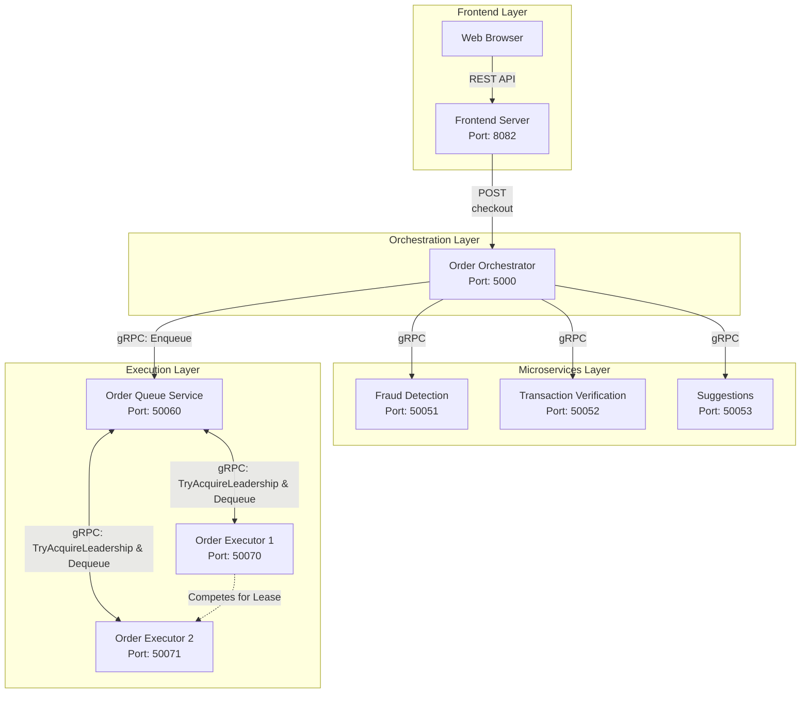
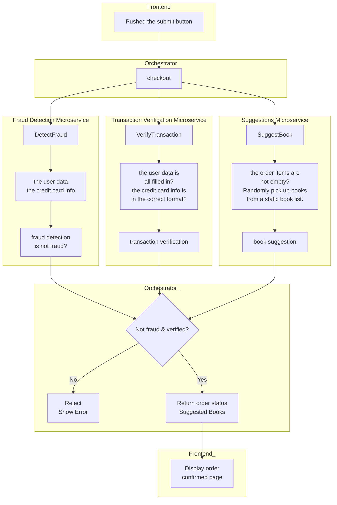
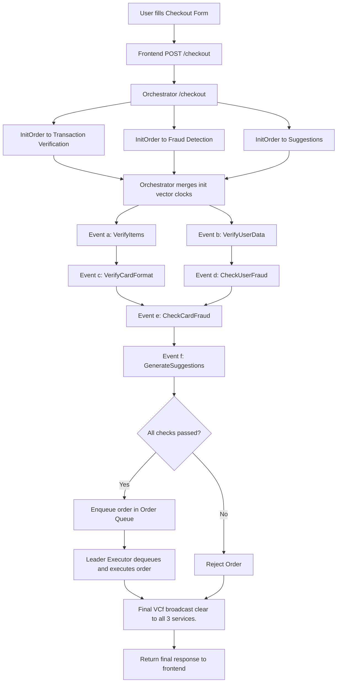
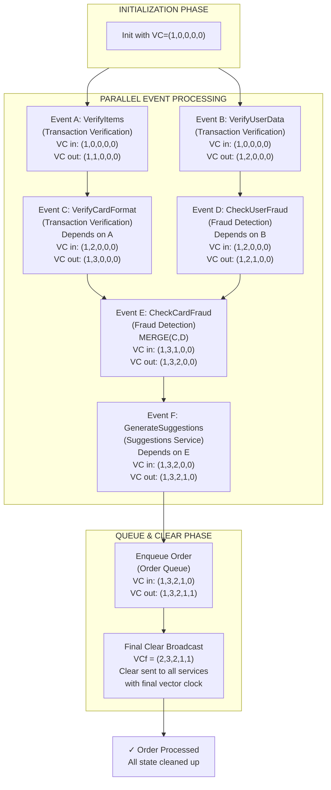
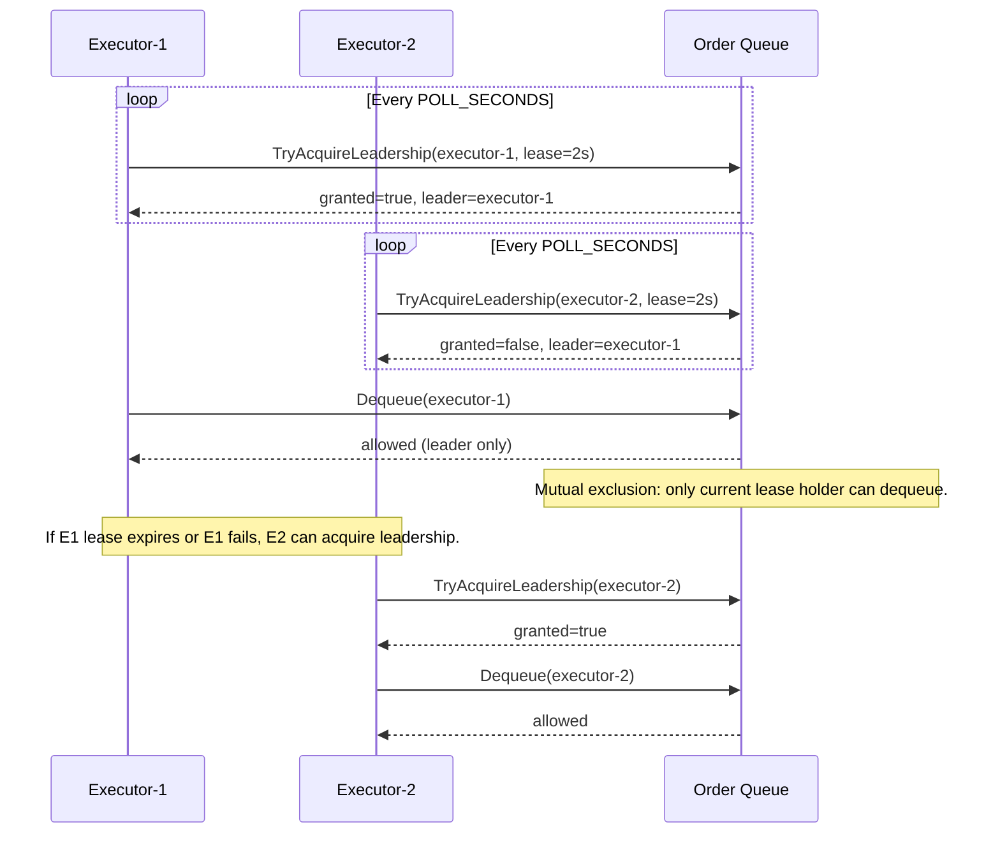
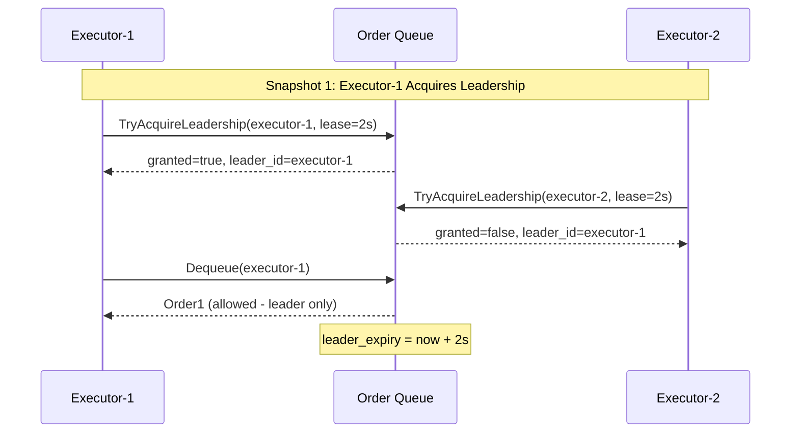
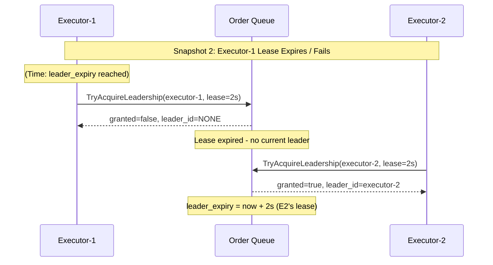
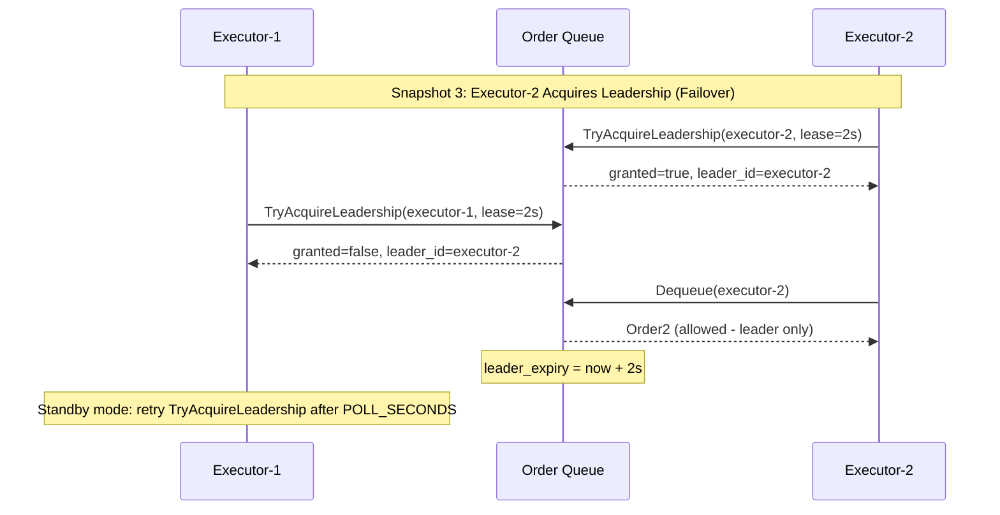
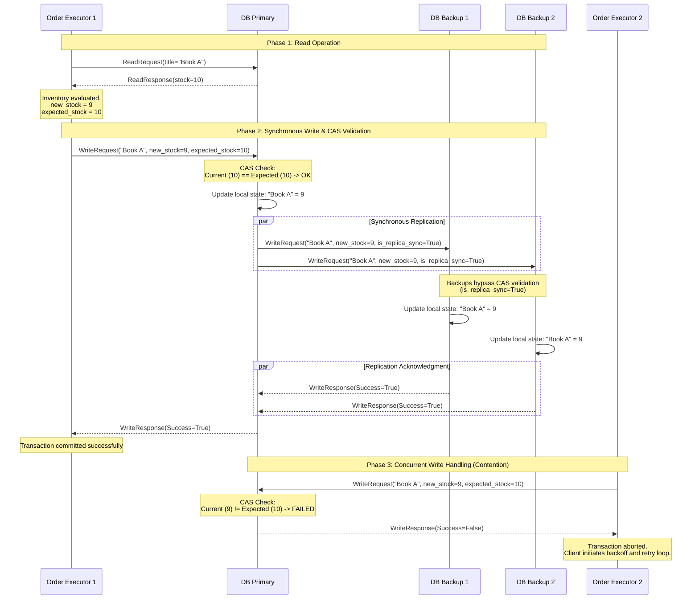

# Distributed Systems 2026 @ University of Tartu

## Online Bookstore System 
A book ordering system built with microservices architecture demonstrating REST, gRPC, concurrent processing, and proper system documentation.

### Project Overview
This project implements a distributed book ordering system where users can submit orders that are processed through multiple backend services. The system showcases key distributed systems concepts including inter-service communication, concurrent processing, and comprehensive logging.

### System Architecture

The architecture follows a layered approach with clear separation of concerns. The frontend communicates with the orchestrator via REST, which then coordinates three gRPC services concurrently.


### System Workflow

## End-to-End System Flow (Checkpoint2)



### Microservices Details

| Service | Port | Protocol | Description |
|---------|------|----------|-------------|
| **Fraud Detection** | 50051 | gRPC | Analyzes user data and credit card information to determine if a transaction is fraudulent using rule-based detection |
| **Transaction Verification** | 50052 | gRPC | Validates that user data is all filled in and credit card information is in the correct format |
| **Suggestions** | 50053 | gRPC | Randomly picks books from a book list to recommend to customers after successful checkout |
| **Order** | 50060 | gRPC | Handles order lifecycle, coordinates validation steps, and manages overall checkout flow |
| **Executor 1** | 50070 | gRPC | Executes tasks concurrently, dispatches service calls, and processes responses |
| **Executor 2** | 50071 | gRPC | Backup/parallel executor instance for load distribution and fault tolerance |

## Vector Clocks Diagram



## Leader Election Diagram






Our leader-election mechanism is lease-based and dynamically supports N executors (N > 2), not just two fixed replicas. Any executor instance with a unique executor_id can compete for leadership by calling TryAcquireLeadership; the order_queue grants leadership to only one active lease holder at a time, so mutual exclusion is preserved for dequeue operations. The system is resilient to failures because if the current leader crashes or stops renewing, its lease expires and another executor automatically becomes leader on the next polling cycle. **This design is centralized**, which makes coordination simple and deterministic, but also introduces trade-offs: the queue service is a potential single point of failure and bottleneck compared to decentralized approaches. **Bonus Point**

## Bonus Points Implementation
- We implemented the bonus requirement in the orchestrator as the final step of every checkout flow, regardless of success or failure. After all worker-thread events complete (or fail), the orchestrator computes the final vector clock VCf (final_clock = tick_orchestrator(latest_clock)) and broadcasts a ClearOrder request to all relevant services (transaction_verification, fraud_detection, and suggestions) through broadcast_final_clear(...). Each service compares its local vector clock with the received VCf using a causal check (local VC <= VCf): if valid, it safely clears cached order state; if not, it refuses cleanup and returns an error. The orchestrator collects and logs any failed clear targets, so incorrect causal states are explicitly reported rather than silently ignored.

- Our leader-election mechanism is lease-based and dynamically supports N executors (N > 2), not just two fixed replicas. Any executor instance with a unique executor_id can compete for leadership by calling TryAcquireLeadership; the order_queue grants leadership to only one active lease holder at a time, so mutual exclusion is preserved for dequeue operations. The system is resilient to failures because if the current leader crashes or stops renewing, its lease expires and another executor automatically becomes leader on the next polling cycle. This design is centralized, which makes coordination simple and deterministic, but also introduces trade-offs: the queue service is a potential single point of failure and bottleneck compared to decentralized approaches.


### Books Database Service Overview

The Books Database functions as a distributed, in-memory key-value store responsible for managing the inventory of items across the microservice ecosystem. To ensure fault tolerance and high availability under heavy system load, the data state is replicated across multiple independent instances. 

The implementation relies on several core distributed systems patterns to maintain data integrity and consistency.

**Primary-Backup Architecture**
The database is structured around a single Primary node and multiple Backup nodes. All read and write requests initiated by the Order Execution layer are routed exclusively to the Primary instance. The Primary is responsible for managing the canonical state of the database and orchestrating the downstream propagation of any updates to the Backup replicas.

**Synchronous Replication**
To prevent data loss and ensure a unified state across the distributed system, a synchronous replication protocol is employed. When a write request modifies the inventory, the Primary first updates its internal local state and subsequently broadcasts the exact update to all connected Backup nodes. The Primary blocks the client transaction and waits for explicit acknowledgments from all active Backups before returning a successful response. This design actively trades lower latency and higher availability for strict sequential consistency, guaranteeing that an acknowledged order is never lost even if the Primary node experiences a catastrophic failure.

**Optimistic Concurrency Control (Compare-And-Swap)**
Given that multiple Order Executors operate in parallel, the system is highly susceptible to race conditions, such as "lost updates" where simultaneous transactions overwrite one another. To safely manage concurrent writes without relying on expensive, highly restrictive distributed locks, Optimistic Concurrency Control (OCC) is utilized via a Compare-And-Swap (CAS) mechanism. 

When an executor submits a write request, it includes an `expected_stock` parameter—reflecting the state of the inventory at the exact moment it was read. Before applying the update, the Primary node evaluates whether the current local stock still matches this expected value. 
*   **If the values match:** The transaction proceeds, and the update is replicated.
*   **If the values differ:** It indicates that another concurrent process has already modified the inventory. The Primary safely rejects the write operation, prompting the initiating executor to back off, re-read the latest state, and retry the transaction.

---

### Consistency Protocol Diagram

Below is the sequence diagram illustrating the complete network flow of the synchronous replication process, alongside the resolution of a concurrent transaction attempt.




---------------------------------------------------------------------------------


### Running the code with Docker Compose [recommended]

To run the code, you need to clone this repository, make sure you have Docker and Docker Compose installed, and run the following command in the root folder of the repository:

```bash
docker compose up
```

This will start the system with the multiple services. Each service will be restarted automatically when you make changes to the code, so you don't have to restart the system manually while developing. If you want to know how the services are started and configured, check the `docker-compose.yaml` file.

The checkpoint evaluations will be done using the code that is started with Docker Compose, so make sure that your code works with Docker Compose.

If, for some reason, changes to the code are not reflected, try to force rebuilding the Docker images with the following command:

```bash
docker compose up --build
```

### Run the code locally

Even though you can run the code locally, it is recommended to use Docker and Docker Compose to run the code. This way you don't have to install any dependencies locally and you can easily run the code on any platform.

If you want to run the code locally, you need to install the following dependencies:

backend services:
- Python 3.8 or newer
- pip
- [grpcio-tools](https://grpc.io/docs/languages/python/quickstart/)
- requirements.txt dependencies from each service

frontend service:
- It's a simple static HTML page, you can open `frontend/src/index.html` in your browser.

And then run each service individually.
