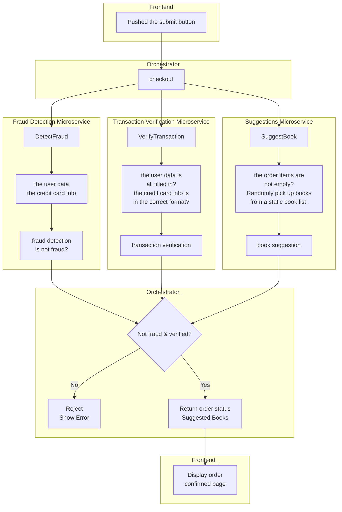
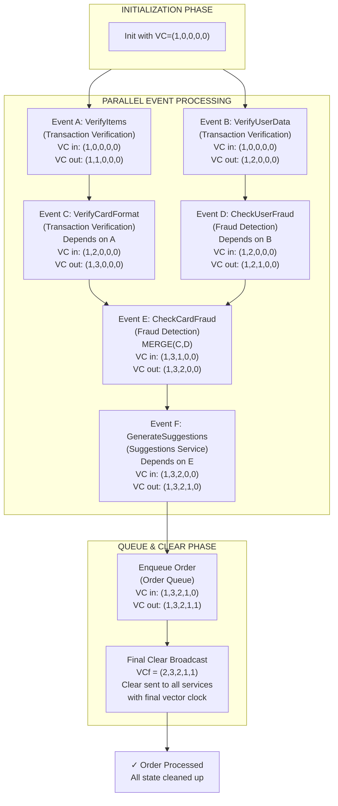
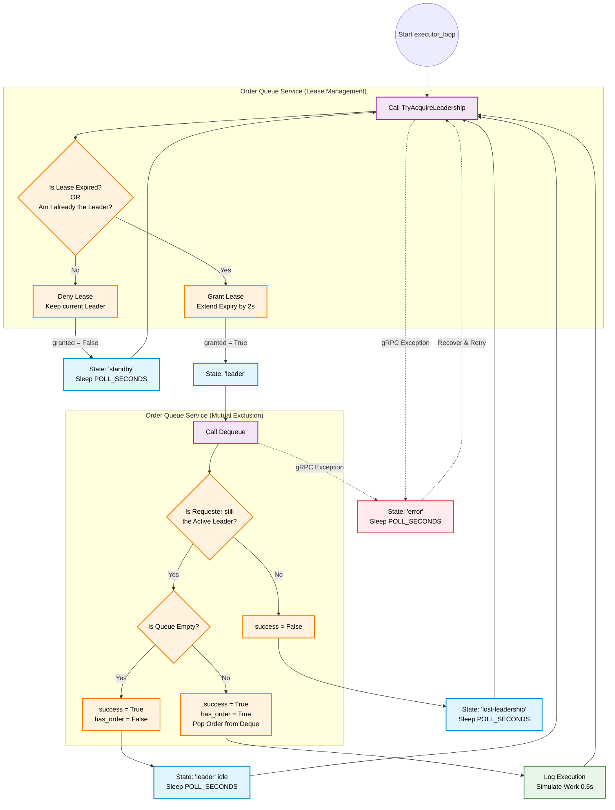

# Distributed Systems 2026 @ University of Tartu

## Online Bookstore System 
A book ordering system built with microservices architecture demonstrating REST, gRPC, concurrent processing, and proper system documentation.

### Project Overview
This project implements a distributed book ordering system where users can submit orders that are processed through multiple backend services. The system showcases key distributed systems concepts including inter-service communication, concurrent processing, and comprehensive logging.

### System Architecture

The architecture follows a layered approach with clear separation of concerns. The frontend communicates with the orchestrator via REST, which then coordinates three gRPC services concurrently.


### System Workflow

### Microservices Details

| Service | Port | Protocol | Description |
|---------|------|----------|-------------|
| **Fraud Detection** | 50051 | gRPC | Analyzes user data and credit card information to determine if a transaction is fraudulent using rule-based detection |
| **Transaction Verification** | 50052 | gRPC | Validates that user data is all filled in and credit card information is in the correct format |
| **Suggestions** | 50053 | gRPC | Randomly picks books from a book list to recommend to customers after successful checkout |
| **Executor** | 50070 | gRPC | Manages concurrent execution of service calls using thread pools, dispatches tasks to services, and aggregates results |

## Vector Clocks Diagram

This sequence diagram illustrates how vector clocks track causality and asynchronous events across the microservices during a single checkout request. It highlights the Orchestrator branching out concurrent requests, how the Transaction Verification service sequentially merges and increments these incoming clocks to establish a strict mathematical order of operations, and how the final merged clock state is ultimately used to safely enqueue the order and clear the distributed caches.

## Leader Election Diagram

This flowchart maps the finite state machine of an order executor as it continuously loops to compete for and process queued orders. It visualizes a centralized, lease-based leader election algorithm managed by the order queue to enforce mutual exclusion: first validating whether the executor can acquire or renew a two-second leadership lease, and second, confirming the executor remains the active leader at the exact moment of dequeueing. This mechanism safely prevents multiple replicas from concurrently processing the same transaction.


---


### Running the code with Docker Compose [recommended]

To run the code, you need to clone this repository, make sure you have Docker and Docker Compose installed, and run the following command in the root folder of the repository:

```bash
docker compose up
```

This will start the system with the multiple services. Each service will be restarted automatically when you make changes to the code, so you don't have to restart the system manually while developing. If you want to know how the services are started and configured, check the `docker-compose.yaml` file.

The checkpoint evaluations will be done using the code that is started with Docker Compose, so make sure that your code works with Docker Compose.

If, for some reason, changes to the code are not reflected, try to force rebuilding the Docker images with the following command:

```bash
docker compose up --build
```

### Run the code locally

Even though you can run the code locally, it is recommended to use Docker and Docker Compose to run the code. This way you don't have to install any dependencies locally and you can easily run the code on any platform.

If you want to run the code locally, you need to install the following dependencies:

backend services:
- Python 3.8 or newer
- pip
- [grpcio-tools](https://grpc.io/docs/languages/python/quickstart/)
- requirements.txt dependencies from each service

frontend service:
- It's a simple static HTML page, you can open `frontend/src/index.html` in your browser.

And then run each service individually.
